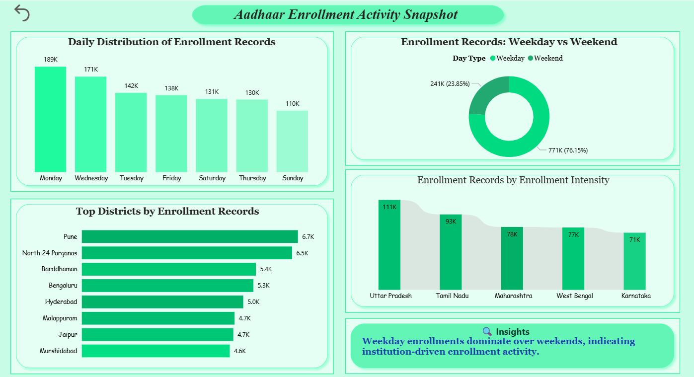

<div align="center">

# 📊 National Aadhaar Enrollment Analysis Dashboard
**A Strategic Decision-Support System for UIDAI Data Hackathon**

[](https://event.data.gov.in)
[](https://powerbi.microsoft.com/)
[](https://github.com/data-analyst-harsh-soni)

---

[Live Dashboard](https://app.powerbi.com/view?r=eyJrljoiYmlwZWU3Y2ItNDc5OC00Y2U2LTg3MjMtZmU1Yjc4NGI0ZjU0liwidCI6IjRhNzhmOWQwLWFIZGUtNDBjNC1hMDg4LTBIOTg5NTk5M2M0YSJ9) • [Problem-Solution](#-problem-solution-analysis) • [Technical Workflow](#-technical-workflow) • [Key Insights](#-key-insights) • [Contact](#-about-the-creator)

</div>

## 📖 Project Overview
[cite_start]This project transforms fragmented Aadhaar enrollment records into actionable insights to support government planning and resource optimization[cite: 43, 483]. [cite_start]Developed for the **UIDAI Data Hackathon**, the dashboard identifies enrollment demand patterns, operational pressure regions, and demographic dominance across India[cite: 42, 46].

---

## 🎯 Problem-Solution Analysis
| Challenge | Solution Provided |
| :--- | :--- |
| [cite_start]**Data Fragmentation:** Records spread across multiple files and time periods[cite: 14]. | [cite_start]**Centralized View:** Consolidated master dataset created using Power Query[cite: 17, 87]. |
| [cite_start]**Operational Pressure:** Centers face sudden, unmanaged crowding[cite: 19]. | [cite_start]**Pressure Classification:** Categorized enrollment periods from Low to Extreme pressure[cite: 29]. |
| [cite_start]**Age-Group Visibility:** Unclear which groups drive national demand[cite: 23]. | [cite_start]**Demographic Segmentation:** Revealed the 0-5 age group as the primary driver[cite: 27, 258]. |
| [cite_start]**Inefficient Allocation:** Uniform resource distribution regardless of local demand[cite: 33]. | [cite_start]**Regional Insights:** State/District-wise pressure analysis for targeted scaling[cite: 38]. |

---

## 🖼️ Dashboard Gallery
*Below are the key analytical modules developed in Power BI:*

| Executive Summary | Demographic Analysis |
|---|---|
|  |  |
| *Macro KPIs & National Performance Snapshot* | *Age-group dominance & population structure* |

| Regional Insights | Student Enrollment Details |
|---|---|
|  |  |
| *District-level demand hotspots & gender trends* | *Institutional tracking & academic enrollment* |

---

## 🔄 Technical Workflow
[cite_start]The data was processed through a structured ETL pipeline to ensure consistency and reliability[cite: 98].


```mermaid
graph LR
    A[Raw CSV Data] --> B{Power Query ETL}
    B --> C[Cleaning & Normalization]
    C --> D[DAX Feature Engineering]
    D --> E[Interactive Dashboard]
    
    style A fill:#f9f,stroke:#333,stroke-width:2px
    style E fill:#00ff00,stroke:#333,stroke-width:4px
