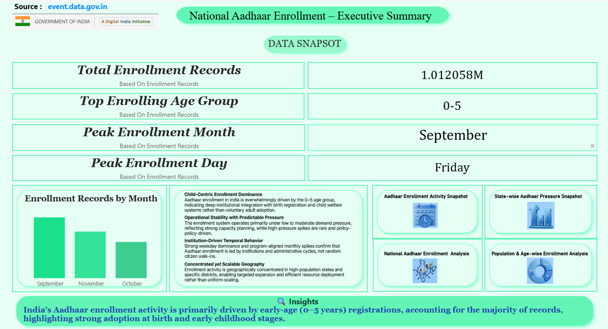

<div align="center">

# 📊 National Aadhaar Enrollment Analysis Dashboard
**Strategic Decision-Support System | UIDAI Data Hackathon**

[](https://app.powerbi.com/view?r=eyJrljoiYmlwZWU3Y2ItNDc5OC00Y2U2LTg3MjMtZmU1Yjc4NGI0ZjU0liwidCI6IjRhNzhmOWQwLWFIZGUtNDBjNC1hMDg4LTBIOTg5NTk5M2M0YSJ9)
[](https://github.com/data-analyst-harsh-soni)

---

[The Problem](#-problem-solution-analysis) • [Technical Workflow](#-technical-workflow) • [Dashboard Gallery](#-dashboard-gallery) • [Key Insights](#-key-insights) • [Contact](#-about-the-creator)

</div>

## 📖 Project Overview
Developed for the **UIDAI Data Hackathon**, this project solves the challenge of "Data Abundance but Insight Scarcity." By processing massive Aadhaar datasets, I built a visual ecosystem that identifies operational bottlenecks and demographic trends across India.

> **Status:** 🟢 Project Complete / ⏳ Hackathon Result Pending

---

## 🎯 Problem-Solution Analysis
| Challenge | Solution Provided |
| :--- | :--- |
| **Data Fragmentation:** Records spread across multiple files. | **Centralized View:** Consolidated master dataset using Power Query. |
| **Operational Pressure:** Centers face sudden, unmanaged crowding. | **Pressure Classification:** Categorized periods into Low to Extreme pressure. |
| **Age-Group Visibility:** Unclear which groups drive demand. | **Demographic Segmentation:** Revealed 0-5 years as the dominant group. |
| **Inefficient Allocation:** Uniform resource distribution regardless of demand. | **Regional Insights:** District-wise pressure analysis for targeted scaling. |

---

## 🖼️ Dashboard Gallery
*Visual representation of all 5 analytical modules developed in Power BI.*

<div align="center">

### 1️⃣ Executive Summary
Macro-view of total enrollments, success rates, and national trends.


---

### 2️⃣ Academic & Regional Deep-Dive
| National Student Overview | National Student Enrollment |
|---|---|
|  |  |
| *High-level student enrollment KPIs* | *Institutional tracking & academic data* |

---

### 3️⃣ Demographic & Regional Analysis
| Age-Wise Enrollment Analysis | Gender & Regional Analysis |
|---|---|
|  |  |
| *Age-group dominance & population structure* | *Geospatial demand hotspots & gender trends* |

</div>

---

## 🔄 Technical Workflow
The data was processed through a structured ETL pipeline to ensure consistency and reliability.


```mermaid
graph LR
    A[Raw CSV Data] --> B{Power Query ETL}
    B --> C[Cleaning & Normalization]
    C --> D[DAX Feature Engineering]
    D --> E[Interactive Dashboard]
    
    %% Styles for High Visibility in Dark/Light Themes %%
    style A fill:#B3E5FC,stroke:#01579B,stroke-width:2px,color:#000
    style B fill:#FFF9C4,stroke:#FBC02D,stroke-width:2px,color:#000
    style C fill:#C8E6C9,stroke:#2E7D32,stroke-width:2px,color:#000
    style D fill:#E1BEE7,stroke:#7B1FA2,stroke-width:2px,color:#000
    style E fill:#F2C811,stroke:#000,stroke-width:4px,color:#000
