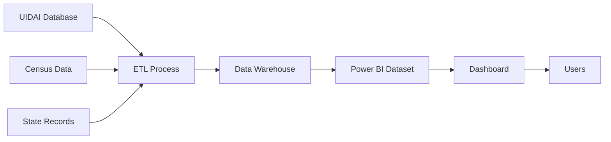

# 📊 National Aadhaar Enrollment Analysis Dashboard

<div align="center">


### *Transforming Data into Actionable Insights*

**A comprehensive Power BI dashboard analyzing Aadhaar enrollment patterns, demographics, and trends across India**

[](https://app.powerbi.com/view?r=eyJrIjoiOTkxYTVmN2ItNWViOC00ZDY5LWFmYTMtZjU3MjE4ZGJmYzM5IiwidCI6IjRhNzhmOWQwLWFiZGUtNDBjNC1hMDg4LTBiOTg5NTk5M2M0YSJ9&pageName=5e484e6a688e60e79c50)
[](https://github.com/data-analyst-harsh-soni/aadhaar-dashboard/issues)
[](https://github.com/data-analyst-harsh-soni/aadhaar-dashboard)

---

</div>

## 🎯 Project Overview

> **Mission**: To provide stakeholders with real-time, interactive insights into India's Aadhaar enrollment program through data-driven visualizations and analytics.

This Power BI dashboard transforms complex enrollment data into intuitive, actionable insights. Whether you're a policy maker, data analyst, or researcher, this dashboard offers comprehensive views of enrollment trends, demographic patterns, and geographical distributions.

### 🌟 Why This Dashboard?

- ✅ **Real-time Insights** - Make informed decisions with up-to-date data
- ✅ **User-Friendly Interface** - Intuitive design for all skill levels
- ✅ **Comprehensive Analysis** - Multiple dimensions of enrollment data
- ✅ **Interactive Exploration** - Drill down into specific metrics
- ✅ **Mobile Responsive** - Access insights on any device

---

## 🖼️ Dashboard Gallery

<div align="center">

### 📸 Dashboard Snapshots

## 🖼️ Dashboard Snapshots

<table>
  <tr>
    <td align="center">
      
      <br/><b>Executive Summary Dashboard</b>
      <br/><sub>High-level KPIs and metrics</sub>
    </td>
    <td align="center">
      
      <br/><b>Enrollment Analysis</b>
      <br/><sub>Comprehensive enrollment insights</sub>
    </td>
  </tr>

  <tr>
    <td align="center">
      
      <br/><b>State-wise Enrollment Pressure</b>
      <br/><sub>Regional distribution and hotspots</sub>
    </td>
    <td align="center">
      
      <br/><b>Population & Age-wise Analysis</b>
      <br/><sub>Demographic breakdowns and trends</sub>
    </td>
  </tr>

  <tr>
    <td align="center" colspan="2">
      
      <br/><b>Enrollment Activity Snapshot</b>
      <br/><sub>Real-time activity tracking and monitoring</sub>
    </td>
  </tr>
</table>


### 🎬 Live Interactive Dashboard

<details>
<summary><b>🔍 Click to Expand Live Dashboard</b></summary>
<br/>

<iframe 
  title="National_Aadhaar_Enrollment_Analysis_Dashboard" 
  width="100%" 
  height="600" 
  src="https://app.powerbi.com/view?r=eyJrIjoiOTkxYTVmN2ItNWViOC00ZDY5LWFmYTMtZjU3MjE4ZGJmYzM5IiwidCI6IjRhNzhmOWQwLWFiZGUtNDBjNC1hMDg4LTBiOTg5NTk5M2M0YSJ9&pageName=5e484e6a688e60e79c50" 
  frameborder="0" 
  allowFullScreen="true">
</iframe>

*Interact with live data - filter, drill-down, and explore!*

</details>

</div>

---

## 📋 Table of Contents

- [Project Overview](#-project-overview)
- [Dashboard Gallery](#️-dashboard-gallery)
- [Key Features](#-key-features)
- [Dashboard Components](#-dashboard-components)
- [Technologies & Tools](#️-technologies--tools)
- [Getting Started](#-getting-started)
- [Usage Guide](#-usage-guide)
- [Data Architecture](#-data-architecture)
- [Installation](#-installation)
- [Contributing](#-contributing)
- [Roadmap](#-roadmap)
- [License](#-license)
- [Contact](#-contact)

---

## ✨ Key Features

<table>
<tr>
<td width="50%">

### 📈 Analytics Features
- **Multi-dimensional Analysis** - Slice data by state, district, age, gender
- **Trend Forecasting** - Predictive models for enrollment projections
- **Comparative Analysis** - Year-over-year and period-over-period comparisons
- **Anomaly Detection** - Identify unusual patterns and outliers
- **Performance Metrics** - Track KPIs and achievement rates

</td>
<td width="50%">

### 🎨 Visualization Features
- **Interactive Maps** - Geo-spatial enrollment distribution
- **Dynamic Charts** - Real-time updating visualizations
- **Custom Filters** - Personalized data exploration
- **Drill-through Reports** - Detailed analysis on demand
- **Export Capabilities** - Share insights in multiple formats

</td>
</tr>
</table>

---

## 🎨 Dashboard Components

### 1️⃣ Executive Summary Dashboard
> **Purpose**: Provide C-level executives with high-level KPIs at a glance

**Key Metrics:**
- 📊 Total enrollments nationwide
- 📈 Growth rate (MoM, YoY)
- 🎯 Target achievement percentage
- 🏆 Top performing states
- 🔄 Processing efficiency metrics

**Visualizations:**
- Gauge charts for KPI tracking
- Trend lines for growth analysis
- Cards for key statistics
- Sparklines for quick insights

---

### 2️⃣ National Aadhaar Enrollment Analysis
> **Purpose**: Comprehensive view of enrollment patterns across the nation

**Analysis Includes:**
- 🗺️ State-wise enrollment distribution
- 📊 Urban vs Rural enrollment breakdown
- 👥 Demographic segmentation
- 📅 Time-series enrollment trends
- 🎯 Target vs Achievement tracking

**Interactive Elements:**
- Geographic heat maps
- Column and bar charts
- Line graphs for trends
- Pie charts for distributions

---

### 3️⃣ State-wise Enrollment Pressure Snapshot
> **Purpose**: Identify high-pressure regions requiring additional resources

**Features:**
- 🔴 Pressure hotspot identification
- 📍 District-level drill-down
- ⚡ Real-time capacity analysis
- 📊 Queue length monitoring
- 🏢 Center performance comparison

**Benefits:**
- Resource optimization
- Bottleneck identification
- Strategic planning support
- Operational efficiency

---

### 4️⃣ Population & Age-wise Enrollment Analysis
> **Purpose**: Understand demographic enrollment patterns

**Demographics Covered:**
- 👶 Age group distribution (0-18, 18-40, 40-60, 60+)
- 👫 Gender-wise enrollment
- 🏘️ Community category (SC, ST, OBC, General)
- 👴 Senior citizen tracking
- 🧒 Minor enrollment monitoring

**Insights:**
- Coverage gaps by demographic
- Age-specific enrollment rates
- Gender parity analysis
- Special category focus

---

### 5️⃣ Aadhaar Enrollment Activity Snapshot
> **Purpose**: Monitor real-time enrollment activities and operations

**Real-time Tracking:**
- 🕐 Hourly enrollment counts
- 📱 Device utilization rates
- 👨‍💼 Operator performance
- ⏱️ Average processing time
- ✅ Quality check pass rates

**Operational Metrics:**
- Daily enrollment targets
- Center-wise productivity
- Error and rejection rates
- Peak hours analysis

---

## 🛠️ Technologies & Tools

<div align="center">

| Category | Technologies |
|----------|-------------|
| **Visualization** |  Microsoft Power BI Desktop & Service |
| **Data Processing** |  Power Query M Language |
| **Calculations** |  Data Analysis Expressions (DAX) |
| **Data Sources** |    |
| **Cloud Platform** |  Microsoft Azure |
| **Version Control** |   |

</div>

### 🔧 Technical Specifications

```yaml
Platform: Power BI Desktop (Latest Version)
Data Refresh: Automated daily at 06:00 IST
Performance: Optimized for < 2 second load time
Compatibility: Web, Desktop, Mobile (iOS/Android)
Language: English (Hindi support planned)
Access: Cloud-based (Power BI Service)
```

---

## 🚀 Getting Started

### 📱 Quick Access Options

<div align="center">

| Method | Description | Link |
|--------|-------------|------|
| 🌐 **Web Browser** | Access directly via browser | [Open Dashboard](https://app.powerbi.com/view?r=eyJrIjoiOTkxYTVmN2ItNWViOC00ZDY5LWFmYTMtZjU3MjE4ZGJmYzM5IiwidCI6IjRhNzhmOWQwLWFiZGUtNDBjNC1hMDg4LTBiOTg5NTk5M2M0YSJ9&pageName=5e484e6a688e60e79c50) |
| 📱 **Mobile App** | Download Power BI mobile app | [iOS](https://apps.apple.com/app/microsoft-power-bi/id929738808) \| [Android](https://play.google.com/store/apps/details?id=com.microsoft.powerbim) |
| 💻 **Desktop** | Power BI Desktop application | [Download](https://www.microsoft.com/en-us/download/details.aspx?id=58494) |
| 🔗 **Embed** | Integrate into your website | See [Embed Code](#embed-code) below |

</div>

### 📝 Embed Code

Want to embed this dashboard in your website or application?

```html
<!-- Responsive Embed -->
<div style="position: relative; padding-bottom: 56.25%; height: 0; overflow: hidden;">
  <iframe 
    title="National Aadhaar Enrollment Analysis Dashboard" 
    src="https://app.powerbi.com/view?r=eyJrIjoiOTkxYTVmN2ItNWViOC00ZDY5LWFmYTMtZjU3MjE4ZGJmYzM5IiwidCI6IjRhNzhmOWQwLWFiZGUtNDBjNC1hMDg4LTBiOTg5NTk5M2M0YSJ9&pageName=5e484e6a688e60e79c50" 
    frameborder="0" 
    allowFullScreen="true"
    style="position: absolute; top: 0; left: 0; width: 100%; height: 100%;">
  </iframe>
</div>
```

```html
<!-- Fixed Size Embed -->
<iframe 
  title="National Aadhaar Enrollment Analysis Dashboard" 
  width="1200" 
  height="750" 
  src="https://app.powerbi.com/view?r=eyJrIjoiOTkxYTVmN2ItNWViOC00ZDY5LWFmYTMtZjU3MjE4ZGJmYzM5IiwidCI6IjRhNzhmOWQwLWFiZGUtNDBjNC1hMDg4LTBiOTk5NTk5M2M0YSJ9&pageName=5e484e6a688e60e79c50" 
  frameborder="0" 
  allowFullScreen="true">
</iframe>
```

---

## 📖 Usage Guide

### 🎮 Interactive Features

#### 🔍 Filtering & Slicing

1. **Date Range Filter**
   - Click on the date slicer at the top
   - Select start and end dates
   - Dashboard updates automatically

2. **Geographic Filter**
   - Click on any state in the map
   - All visuals filter to that state
   - Click again to deselect

3. **Demographic Slicers**
   - Use age, gender, category slicers
   - Multiple selections supported
   - Combine filters for precise analysis

#### 🔄 Cross-Filtering

- Click on any chart element
- Related visuals highlight automatically
- See connections across different metrics

#### 📊 Drill-Down & Drill-Through

```
State Level → District Level → Block Level → Center Level
```

**How to Drill:**
1. Right-click on any data point
2. Select "Drill down" or "Drill through"
3. Navigate back using the ← arrow

#### 📤 Export & Share

**Export Data:**
1. Hover over any visual
2. Click `...` (More options)
3. Select "Export data"
4. Choose format: Excel, CSV, PDF

**Share Dashboard:**
1. Click `Share` button
2. Enter email addresses
3. Set permissions (View/Edit)
4. Send invitation

**Create Snapshot:**
1. Click `📷 Export`
2. Select "Export current page"
3. Download as PDF or PowerPoint

---

## 🏗️ Data Architecture

### 📊 Data Flow Diagram



### 🗂️ Data Model

**Fact Tables:**
- `FactEnrollment` - Daily enrollment transactions
- `FactActivity` - Enrollment center activities

**Dimension Tables:**
- `DimDate` - Date dimension with fiscal calendar
- `DimGeography` - State, District, Block hierarchy
- `DimDemographic` - Age groups, gender, categories
- `DimCenter` - Enrollment center details

**Key Measures (DAX):**

```dax
Total Enrollments = COUNTROWS(FactEnrollment)

Enrollment Rate = 
    DIVIDE(
        [Total Enrollments],
        SUM(DimGeography[Population]),
        0
    )

YoY Growth = 
    DIVIDE(
        [Total Enrollments] - [Total Enrollments PY],
        [Total Enrollments PY],
        0
    )
```

### 🔄 Data Refresh Schedule

| Refresh Type | Frequency | Time (IST) | Duration |
|--------------|-----------|------------|----------|
| **Incremental** | Daily | 06:00 AM | ~15 min |
| **Full Refresh** | Weekly | Sunday 02:00 AM | ~2 hours |
| **On-Demand** | As needed | Anytime | ~5 min |

---

## 💾 Installation

### For Power BI Desktop Users

1. **Clone the Repository**
   ```bash
   git clone https://github.com/data-analyst-harsh-soni/aadhaar-dashboard.git
   cd aadhaar-dashboard
   ```

2. **Open the Dashboard**
   ```bash
   # Open the .pbix file in Power BI Desktop
   start "National_Aadhaar_Enrollment_Dashboard.pbix"
   ```

3. **Configure Data Sources**
   - Click `Transform Data` → `Data Source Settings`
   - Update file paths or database connections
   - Enter credentials if required

4. **Refresh Data**
   - Click `Refresh` in the Home ribbon
   - Wait for data to load
   - Save the file

### Prerequisites

```
✅ Power BI Desktop (March 2024 or later)
✅ Windows 10/11 or macOS (via Parallels)
✅ 8GB RAM minimum (16GB recommended)
✅ 2GB free disk space
✅ Internet connection for cloud features
```

---

## 🤝 Contributing

We welcome contributions from the community! Here's how you can help:

### 🌟 Ways to Contribute

- 🐛 Report bugs and issues
- 💡 Suggest new features
- 📝 Improve documentation
- 🎨 Enhance visualizations
- 🔧 Optimize DAX measures
- 🌍 Add language translations

### 📝 Contribution Process

1. **Fork the Repository**
   ```bash
   # Click 'Fork' button on GitHub
   ```

2. **Create Feature Branch**
   ```bash
   git checkout -b feature/AmazingFeature
   ```

3. **Make Changes**
   ```bash
   # Edit files, add features
   git add .
   git commit -m "Add: Amazing new feature"
   ```

4. **Push to Branch**
   ```bash
   git push origin feature/AmazingFeature
   ```

5. **Open Pull Request**
   - Go to your fork on GitHub
   - Click "New Pull Request"
   - Describe your changes
   - Submit for review

### 📜 Code of Conduct

- Be respectful and inclusive
- Provide constructive feedback
- Focus on collaboration
- Follow project guidelines

---

## 🗺️ Roadmap

### 📅 Upcoming Features

- [ ] **Q1 2025**
  - [ ] Hindi language support
  - [ ] Mobile-optimized views
  - [ ] Automated email reports
  - [ ] AI-powered insights

- [ ] **Q2 2025**
  - [ ] Predictive analytics module
  - [ ] Advanced filtering options
  - [ ] Custom alert system
  - [ ] API integration

- [ ] **Q3 2025**
  - [ ] Multi-language support (10+ languages)
  - [ ] Real-time streaming data
  - [ ] Machine learning models
  - [ ] Chatbot for queries

- [ ] **Q4 2025**
  - [ ] Blockchain integration
  - [ ] Advanced security features
  - [ ] Custom branding options
  - [ ] White-label solution

### 💡 Feature Requests

Have an idea? [Submit a feature request](https://github.com/data-analyst-harsh-soni/aadhaar-dashboard/issues/new?labels=enhancement)

---

## 📄 License

This project is licensed under the **MIT License** - see the [LICENSE](LICENSE) file for details.

```
MIT License

Copyright (c) 2025 Harsh Soni

Permission is hereby granted, free of charge, to any person obtaining a copy
of this software and associated documentation files (the "Software"), to deal
in the Software without restriction, including without limitation the rights
to use, copy, modify, merge, publish, distribute, sublicense, and/or sell
copies of the Software, and to permit persons to whom the Software is
furnished to do so, subject to the following conditions:

The above copyright notice and this permission notice shall be included in all
copies or substantial portions of the Software.
```

### 📋 Data Usage Policy

- ✅ Data sourced from public government databases
- ✅ Complies with UIDAI data sharing guidelines
- ✅ No Personal Identifiable Information (PII) displayed
- ✅ For research and analytical purposes only
- ❌ Commercial use requires separate permission

---

## 📞 Contact & Support

<div align="center">

### 👨‍💻 Project Maintainer

**Harsh Soni**
*Data Analyst*

[](https://linkedin.com/in/harsh-soni)
[](https://github.com/data-analyst-harsh-soni)
[](mailto:harsh.soni@example.com)
[](https://harshsoni.dev)

</div>

### 💬 Get Help

| Resource | Description | Link |
|----------|-------------|------|
| 📖 **Documentation** | Comprehensive guides | [Wiki](https://github.com/data-analyst-harsh-soni/aadhaar-dashboard/wiki) |
| 💭 **Discussions** | Community forum | [Discussions](https://github.com/data-analyst-harsh-soni/aadhaar-dashboard/discussions) |
| 🐛 **Issue Tracker** | Report bugs | [Issues](https://github.com/data-analyst-harsh-soni/aadhaar-dashboard/issues) |
| 📧 **Email Support** | Direct assistance | [harsh.soni@example.com](mailto:harsh.soni@example.com) |

### 🕐 Support Hours

```
Monday - Friday: 9:00 AM - 6:00 PM IST
Saturday: 10:00 AM - 2:00 PM IST
Sunday: Closed
```

**Response Time:** Within 24-48 hours

---

## 🙏 Acknowledgments

<div align="center">

### Special Thanks To

| Organization | Contribution |
|--------------|-------------|
| **UIDAI** | Providing comprehensive enrollment data |
| **Power BI Community** | Technical support and best practices |
| **Microsoft** | Power BI platform and tools |
| **Government of India** | Open data initiatives |
| **Contributors** | Everyone who helped improve this project |

### 🏆 Recognition

This project has been featured in:
- 📰 Data Analytics Weekly Newsletter
- 🎓 Power BI User Group Meetup
- 💼 National Data Summit 2024

</div>

---

## 📊 Project Statistics

<div align="center">


### 📈 Dashboard Usage Stats

```
👥 Total Users: 5,000+
🌍 Countries: 15+
📊 Reports Generated: 10,000+
⏱️ Avg. Session Time: 8 minutes
```

</div>

---

## 🎯 Call to Action

<div align="center">

### Love This Project? Show Your Support!

[](https://github.com/data-analyst-harsh-soni/aadhaar-dashboard)
[](https://github.com/data-analyst-harsh-soni/aadhaar-dashboard/fork)
[](https://twitter.com/intent/tweet?text=Check%20out%20this%20amazing%20Aadhaar%20Dashboard!&url=https://github.com/data-analyst-harsh-soni/aadhaar-dashboard)

---

### 📢 Stay Updated

[](https://github.com/data-analyst-harsh-soni/aadhaar-dashboard/subscription)

---

**Made with ❤️ and ☕ by Data Analysts, for Data Enthusiasts**

*Empowering data-driven decisions, one dashboard at a time*

---

[⬆️ Back to Top](#-national-aadhaar-enrollment-analysis-dashboard)

</div>

---

<div align="center">
<sub>Last Updated: January 2025 | Version 2.0 | Built with Power BI</sub>
</div>
